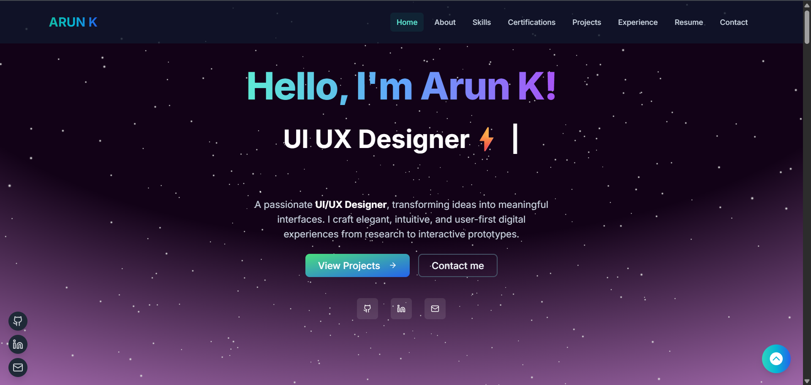
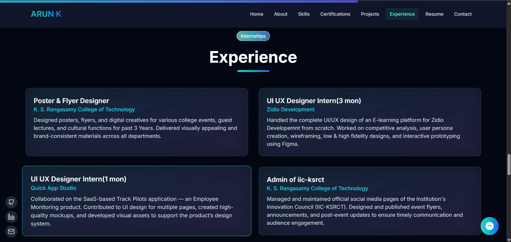

# My Portfolio Website

[](https://arunk-dev.vercel.app/)
&nbsp;
[](https://www.linkedin.com/in/arun-k19/)
&nbsp;
[](https://github.com/ArunK-003/)

## 1. Project Overview

This repository contains the source code for my personal 3D portfolio website. Designed to be an interactive and engaging experience, this portfolio showcases my projects, skills, and professional background in a unique, three-dimensional web environment. The goal was to move beyond traditional portfolio layouts and demonstrate my ability to work with modern web technologies like Design and Development.

## 2. Key Features

- **Interactive 3D Models**: Engaging, interactive 3D elements created with Three.js.
- **Smooth Animations & Transitions**: Seamless user experience powered by Framer Motion.
- **Responsive Design**: Fully optimized for a consistent and accessible experience across all devices—desktops, tablets, and mobile phones.
- **Modern UI/UX**: A clean, intuitive, and visually appealing user interface built with reusable React components.
- **Contact Form Integration**: A functional contact form using formsubmit for easy communication.

## 3. Technologies & Tools

This project was built using a modern tech stack, including:

| Category               | Technology                                    |
| :--------------------- | :-------------------------------------------- |
| **Frontend Framework** | Next.js                                       |
| **3D Graphics**        | Three.js, React Three Fiber, React Three Drei |
| **Styling**            | Tailwind CSS                                  |
| **Animation**          | Framer Motion                                 |
| **Email Service**      | Web3Forms                                     |
| **Deployment**         | Vercel                                        |

## 4. Setup and Installation

To run this project locally, follow these simple steps:

1. **Clone the repository:**

   ```sh
   git clone https://github.com/ArunK-003/arunk-portfilio.git
   ```

2. **Navigate to the project directory:**

   ```sh
   cd arunK-portfolio
   ```

3. **Install NPM packages:**

   ```sh
   npm install
   ```

4. **Run the development server:**

   ```sh
   npm run dev
   ```

   Open [http://localhost:3000](http://localhost:3000) (or the port shown in your terminal) to view it in the browser.

## 5. Screenshots





## 6. Contact

I'm currently seeking new opportunities as a Junior Developer. If you're interested in my work or have any questions, please feel free to connect with me!

- **LinkedIn**: [Dương Hoàng Lan Anh](https://www.linkedin.com/in/arun-k19/)
- **Email**: ksarun459@gmail.com

Thank you for visiting my repository!
